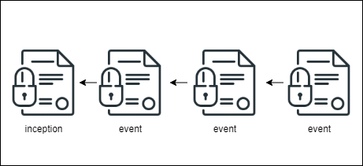

# IDP2P

> `Experimental`, inspired by `ipfs`, `did:peer` and `keri`

## Background

See also (related topics):

* [Decentralized Identifiers (DIDs)](https://w3c.github.io/did-core)
* [Verifiable Credentials](https://www.w3.org/TR/vc-data-model/)
* [IPFS](https://ipfs.io/)
* [LIBP2P](https://libp2p.io/)
* [Key DID](https://github.com/w3c-ccg/did-method-key/)
* [Peer DID](https://identity.foundation/peer-did-method-spec/)
* [Key Event Receipt Infrastructure](https://keri.one//)

## Problem

Each did method uses own way to implement decentralized identity.
Most of them are based on public source of truth like a `blockchain`, `dlt`, `database` or similar.
Others are simple, self-describing methods and don't depend on any ledger technology e.g. `did:peer`, `did:key`, `keri`.
Each method has its own pros-cons in terms of [design-goals](https://www.w3.org/TR/did-core/#design-goals).

## IDP2P Solution 

`IDP2P` is a peer-to-peer identity protocol which enables a controller to create, manage and share its own proofs as well as did documents. 
The protocol is based on [libp2p](https://libp2p.io/), in other words, it can be considered `ipfs` of decentralized identity. `IDP2P` has following features:

- Self-describing identity(like `did:keri`, `did:peer`, `did:key`)
- Based on `libp2p` pub-sub protocol, so it can be stored and resolved via network
- P2P network provides one ledger per identity
- Only identity owner and verifiers are responsible for storing and verifying identity


### Consensus Mechanism 

When an identity event has occured, change is published over `idp2p` network, all subscribers verifies new change and updates its own ledger if incoming change is suitable.

There are two pub-sub commands: 

- `get`: when a peer want to subscribe to an identity, it publishs a `get` command with `id` over the network. 
- `post`: when a peer received a `get` command or an identity change occured, it posts identity information to subscribers in order to reach a consensus

 

An identity is also a topic to subsribe(it means ledger is based on subscription)

 


### Identity

An `idp2p` identity includes unique identifier, microledger and DID document. 

```json
{
    "id": "did:p2p:z6MkpTHR8VNsBxYAAWHut2Geadd9jSwuBV8xRoAnwWsdvktH",
    "microledger": {},
    "document": {}
}
```

*`id`* is the unique identifier of identity. It uses id generation like `did:peer`. ID should be generated following way: 

- Generate an inception block
- Get json string of the block
- Convert it to bytes
- Get SHA-256 digest of bytes
- Encode it with multibase and multicodec(like `ipfs`)

*sample id*: `did:p2p:bagaaieratxin4o3iclo7ua3s3bbueds2uzfc5gi26mermevzb2etqliwjbla`

`microledger` represents backing storage of identity and it includes id, inception and events for identity

```json
  {
    "id": "bagaaieratxin4o3iclo7ua3s3bbueds2uzfc5gi26mermevzb2etqliwjbla",
    "inception": {},
    "events": []
  }
```

`inception` includes `keyType` `next` and `recovery` public key digest

```json
{
  "keyType": "Ed25519VerificationKey2020",
  "nextKeyDigest": "<base32 value of next public key digest",
  "nextKeyDigest": "<base32 value of recovery public key digest"
}
```

`events` is array of identity changes and each event is linked to the previous one. First event is linked inception block.

 


```json
{
    "payload": {
      "previous": "<inception-hash>",
      "signerKey": "by5gtwpufy4zfnog4j..",
      "nextKeyDigest": "by5gtwpufy4zfnog4j..",
      "change": {
        "type": "SetDocument",
        "value": "bdu3gqtjc6ks52.."
      },
      "timestamp": 1642418658
    },
    "proof": "bx6svqb6if5yaflgoumdff7j.."
}
```

There are three event types.

- `SetDocument`: proof of did document change, requires `value` property which is hash of did document.
- `SetProof`: any proof about identity,  requires `key` and `value` properties.
- `Recover` recovery proof of identity requires `keyType` and `recoveryKeyDigest` properties.

`did_doc` is described in [DIDs Spec](https://www.w3.org/TR/did-core/). Only latest document is stored in identity.

```json
{
    "id": "did:p2p:bagaaieratxin..",
    "controller": "did:p2p:bagaaieratxi..",
    "@context": [
        "https://www.w3.org/ns/did/v1",
        "https://w3id.org/security/suites/ed25519-2020/v1",
        "https://w3id.org/security/suites/x25519-2020/v1"
    ],
    "verificationMethod": [...],
    "assertionMethod": ["did:p2p:bagaaieratxib#wtyb2xhyvxolbd.."],
    "authentication": ["did:p2p:bagaaieratxib#3txadadmtke6d.."],
    "keyAgreement": ["did:p2p:bagaaieratxib#cnzphk5djc3bt64.."]
}
```


#### *Full example*

```json
{
    "id": "bagaaieratxin4o3iclo7ua3s3bbueds2uzfc5gi26mermevzb2etqliwjbla",
    "microledger": {
        "inception": {
            "keyType": "Ed25519VerificationKey2020",
            "nextKeyDigest": "by5gtwpufy4..",
            "recoveryKeyDigest": "bmb2cvioxfy65ej.."
        },
        "events": [
            {
                "payload": {
                    "previous": "bagaaieratxin4o3iclo7u..",
                    "signerKey": "by5gtwpufy4zfnog4j..",
                    "nextKeyDigest": "b2wvipekepehi..",
                    "change": {
                        "type": "SetDocument",
                        "value": "bdu3gqtjc6ks52.."
                    },
                    "timestamp": 1642418658
                },
                "proof": "bx6svqb6if5yaflgoumdff7j.."
            },
            {
                "payload": {
                    "previous": "bagaaieratxin4o3iclo7u..",
                    "signerKey": "by5gtwpufy4zfnog4j..",
                    "nextKeyDigest": "b2wvipekepehi..",
                    "change": {
                        "type": "SetProof",
                        "key": "bnnsxs",
                        "value": "bozqwy5lf"
                    },
                    "timestamp": 1642418658
                },
                "proof": "bwltjvobkxxq6.."
            },
            {
                "payload": {
                    "previous": "bagaaieratxin4o3iclo7u..",
                    "signerKey": "by5gtwpufy4zfnog4j..",
                    "nextKeyDigest": "b2wvipekepehi..",
                    "change": {
                        "type": "Recover",
                        "keyType": "Ed25519VerificationKey2020",
                        "recoveryKeyDigest": "bcut3s....."
                    },
                    "timestamp": 1642418658
                },
                "proof": "b3yo6vlymyn.."
            }
        ]
    },
    "document": {
        "@context": [
            "https://www.w3.org/ns/did/v1",
            "https://w3id.org/security/suites/ed25519-2020/v1",
            "https://w3id.org/security/suites/x25519-2020/v1"
        ],
        "id": "did:p2p:bagaaieratxin..",
        "controller": "did:p2p:bagaaieratxi..",
        "verificationMethod": [],
        "assertionMethod": [
            "did:p2p:bagaaieratxib#wtyb2xhyvxolbd.."
        ],
        "authentication": [
            "did:p2p:bagaaieratxib#3txadadmtke6d.."
        ],
        "keyAgreement": [
            "did:p2p:bagaaieratxib#cnzphk5djc3bt64.."
        ]
    }
}
```

## Contributions

The idp2p protocol and implementations are work in progress. 

Contributions are most welcome

## License

[Apache License 2.0](LICENSE) 
