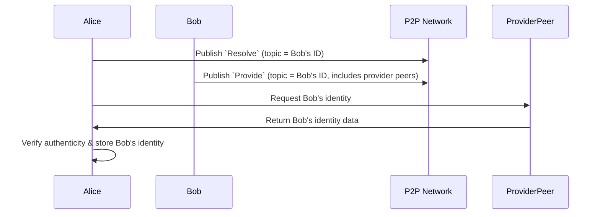
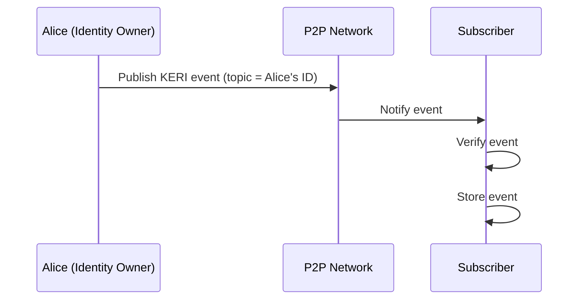
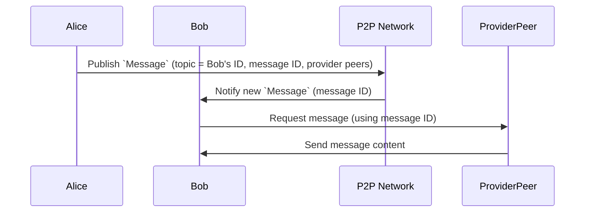

# idp2p

> `Experimental`, inspired by `ipfs`, and `keri`

## Background

See also (related topics):

* [Decentralized Identifiers (DIDs)](https://w3c.github.io/did-core)
* [Key Event Receipt Infrastructure](https://keri.one//)
* [DIDComm](https://didcomm.org/)
* [IPFS](https://ipfs.io/)

## The Problem

> `Alice` has a secret message for `Bob`, but she doesn't know who `Bob` is or where he is. 

DIDs and DIDComm address this challenge by providing decentralized identifiers with built‐in service endpoints and mediator support. This allows Alice to discover Bob's DID and send her message securely.

KERI (Key Event Receipt Infrastructure) further strengthens the system by managing identities in a truly decentralized, ledger-independent way. It uses secure, self‑sovereign keys and event-based updates to maintain identity integrity.

While DIDs, DIDComm, and KERI provide a robust framework for decentralized messaging and identity management, several challenges remain to fully realize a seamless self‑sovereign identity ecosystem. Addressing these challenges is essential for ensuring reliable identity resolution, efficient communication, and long‑term protocol evolution. The key challenges include:

- **DID Resolution:** How to reliably resolve a decentralized identifier.
- **Event Notification:** How to efficiently notify subscribers about KERI events.
- **Messaging:** How to send or broadcast messages to multiple subscribers.
- **Protocol Evolution:** How to manage identity protocol changes and support multiple implementations.

This overview lays the groundwork for addressing these challenges within a self-sovereign identity ecosystem.

## The Solution(idp2p)

> Peer to peer identity protocol based on keri, webassembly and libp2p

idp2p is a decentralized identity protocol that leverages peer-to-peer networks to enable secure and efficient identity discovery, notification, and messaging. It combines a pubsub (publish-subscribe) model with robust decentralized technologies to address modern identity challenges.

 

## Identity Layer

> KERI implementation with webassembly

  - **KERI (Key Event Receipt Infrastructure):**  
    Manages identities using secure, event-based updates without relying on a central ledger.
  - **WebAssembly:**  
    Ensures deterministic execution, security, and portability, allowing the identity layer to run seamlessly across platforms.

## Peer-to-Peer (P2P) Network Layer

> Based on libp2p gossipsub protocol

### Resolve

> Alice wants to resolve Bob's ID

1. **Alice Publishes a `Resolve` Message**  
   Alice begins by publishing a `Resolve` message onto the network. This message includes Bob’s ID as the topic she wants to resolve.

2. **Bob Publishes a `Provide` Message**  
   Upon noticing that there is a `Resolve` request for his ID, Bob publishes a `Provide` message with the same topic (Bob’s ID). This message specifies a list of peers (called “provider peers”) who can supply the necessary identity information.

3. **Alice Requests Bob’s Identity from a Provider Peer**  
   After receiving Bob’s `Provide` message, Alice selects one of the provider peers and sends a direct request, asking for Bob’s identity data.

4. **Provider Peer Sends Response**  
   The selected provider peer responds by sending Bob’s identity information to Alice.

5. **Alice Verifies and Stores Bob’s Identity**  
   Once the response is received, Alice verifies the authenticity of Bob’s identity data. Upon successful verification, she stores Bob’s identity for future reference.

---

### Notify Event

> Alice has an keri event and she wants to notify her subscribers

1. **Identity Owner Publishes Event**  
   Alice, acting as the identity owner, generates a KERI event and publishes it to the network using her own ID as the topic.

2. **Network Notifies Subscribers**  
   The P2P network delivers the event to Alice’s subscribers.

3. **Subscriber Verifies and Stores Event**  
   Upon receiving the event, each subscriber verifies the event’s integrity/authenticity and, if valid, stores the event locally.

### Notify Direct Message

> Alice wants to send a message to Bob 

1. **Alice Publishes a `Message`**  
   Alice publishes a `Message` onto the network with:
   - **Topic**: Bob’s ID  
   - **Message ID**: A unique identifier for the message  
   - **Providers**: A list of provider peers that can supply the message content  

2. **Bob Notices the New Message**  
   The P2P network (or whichever messaging infrastructure is used) notifies Bob that there is a new message for him (identified by the `Message ID`).

3. **Bob Requests the Message**  
   Bob sends a request to one of the listed provider peers to fetch the actual message content.

4. **Provider Sends the Message**  
   The provider peer responds with the message, and Bob receives it.

### Notify Broadcast Message

> Alice wants to publish for all subsribers

1. **Alice Publishes a Broadcast Message**  
   - **Topic**: Alice’s ID  
   - **Message ID**: A unique identifier  
   - **Providers**: A list of provider peers (where the message content can be fetched)

2. **Network Notifies All Subscribers**  
   Any subscriber that is subscribed to Alice’s ID receives a notification about the new broadcast message.

3. **Subscribers Request the Broadcast Message**  
   Each subscriber selects a provider peer and requests the message content using the `Message ID`.

4. **Provider Peer Delivers the Message**  
   The chosen provider peer responds by sending the broadcast message content to each subscriber.

### Mediator Mechanism

> Alice needs a network agent in order to publishs and receives messages

## Demo
