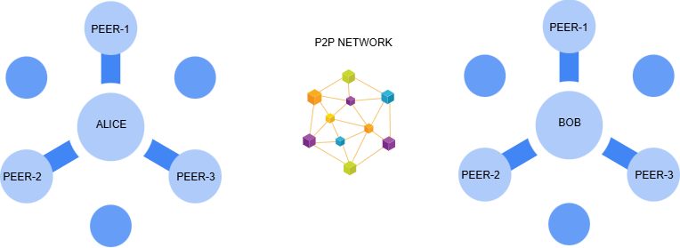
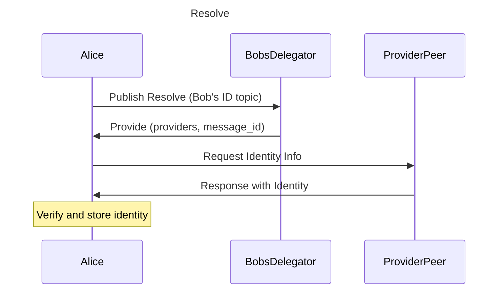

# idp2p

> `Experimental`, inspired by `ipfs`, and `keri`

## Background

See also (related topics):

* [Decentralized Identifiers (DIDs)](https://w3c.github.io/did-core)
* [Key Event Receipt Infrastructure](https://keri.one//)
* [DIDComm](https://didcomm.org/)
* [IPFS](https://ipfs.io/)

## The Problem

> `Alice` has a secret message for `Bob`, but she doesn't know who `Bob` is or where he is. 

DIDs and DIDComm address this challenge by providing decentralized identifiers with built‐in service endpoints and mediator support. This allows Alice to discover Bob's DID and send her message securely.

KERI (Key Event Receipt Infrastructure) further strengthens the system by managing identities in a truly decentralized, ledger-independent way. It uses secure, self‑sovereign keys and event-based updates to maintain identity integrity.

While DIDs, DIDComm, and KERI provide a robust framework for decentralized messaging and identity management, several challenges remain to fully realize a seamless self‑sovereign identity ecosystem. Addressing these challenges is essential for ensuring reliable identity resolution, efficient communication, and long‑term protocol evolution. The key challenges include:

- **DID Resolution:** How to reliably resolve a decentralized identifier.
- **Event Notification:** How to efficiently notify subscribers about KERI events.
- **Ensuring Uniqueness:** How to maintain identity uniqueness.
- **Broadcasting:** How to send or broadcast messages to multiple subscribers.
- **Protocol Evolution:** How to manage identity protocol changes and support multiple implementations.

This overview lays the groundwork for addressing these challenges within a self-sovereign identity ecosystem.

## The Solution(idp2p)

> Peer to peer identity protocol based on keri, webassembly and libp2p

idp2p is a decentralized identity protocol that leverages peer-to-peer networks to enable secure and efficient identity discovery, notification, and messaging. It combines a pubsub (publish-subscribe) model with robust decentralized technologies to address modern identity challenges.

 

### Identity Layer

> KERI implementation with webassembly

  - **KERI (Key Event Receipt Infrastructure):**  
    Manages identities using secure, event-based updates without relying on a central ledger.
  - **WebAssembly:**  
    Ensures deterministic execution, security, and portability, allowing the identity layer to run seamlessly across platforms.

### Peer-to-Peer (P2P) Network Layer

> Based on libp2p gossipsub protocol

#### Resolve

> Alice wants to connect Bob 

- Alice publishs a `Resolve` message with the topic(Bob's id)
- Bob's delegator or owner publishs a `Provide` with same topic, the Provide message has `provider peers` and `message_id` 
- Alice send a request to one of the provider peer in order to retrieve Bob's identity info
- When the provider sends response, Alice verifies the identity and store it

#### Notify Event

> Alice has an keri event and she wants to notify her subscribers

- Whenever an identity event occurs, the identity owner publishs an event with own id topic
- When a subscriber receives the event, it verifies first then store the event

#### Notify Message

> Alice wants to send a message to Bob 

- Alice publishs a `Message` message with message id and providers for the topic(Bob's id)

- When Bob's delegator or owner receives the message, it sends a request to get the message

- When the provider sends response, Bob receives the message

### Mediator Mechanism

> Alice needs a network agent in order to publishs and receives messages

## Demo
