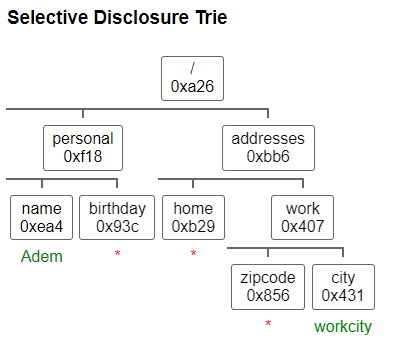

# Selective Disclosure Trie

> "Selective Disclosure Trie" is a solution proposal that uses a data structure called a trie, to enable efficient and secure selective disclosure of fields from verifiable credentials for privacy enhancement 

Verifiable credentials are digital representations of claims made about an individual, such as their name, age, and qualifications. They have the potential to revolutionize the way in which we prove our identity and share information online. However, in order for verifiable credentials to be widely adopted, privacy concerns must be addressed.

One such concern is the disclosure of unnecessary information. When sharing a verifiable credential, an individual may be required to reveal more information than is necessary for the intended purpose. For example, an individual may be asked to share their entire passport when all that is needed is their name and date of birth. This not only breaches the individual's privacy, but also increases the risk of sensitive information being compromised.

This is where the "Selective Disclosure Trie" proposal comes in. The solution is based on organizing the fields of a credential in a data structure called a trie. A trie is a tree-like data structure that allows for efficient and secure storage and retrieval of large numbers of fields. Each node in the trie represents a field of the credential.

With the Selective Disclosure Trie, individuals can choose which branches of the trie to reveal, thereby disclosing only the necessary information. This enhances privacy by allowing individuals to share only the information that is required for a specific purpose, rather than the entire credential.

The Selective Disclosure Trie also allows for efficient management of large numbers of fields in a verifiable credential, making it well-suited for use in real-world systems. It also ensures that only authorized parties can access the information and that the information is tamper-proof.

In conclusion, the privacy is an essential aspect in verifiable credential ecosystem, and the Selective Disclosure Trie proposal provides a solution that addresses this concern. By allowing individuals to selectively disclose only the necessary fields of a credential, the proposal enhances privacy and security while also allowing for efficient management of large numbers of fields.

Consider the example of a verifiable credential in JSON format, with personal information such as name, surname, gender and birthday, phone numbers and addresses with their zipcodes and cities(You can give it a try by visiting the following link: https://tudnme.csb.app/).

```json
{
  "personal": {
    "name": {
      "salt": "random",
      "raw": "Adem"
    },
    "birthday": {
      "salt": "random",
      "raw": "1.1.1984"
    }
  },
  "addresses": {
    "home": {
      "zipcode": {
        "salt": "random",
        "raw": "2020"
      },
      "city": {
        "salt": "random",
        "raw": "homecity"
      }
    },
    "work": {
      "zipcode": {
        "salt": "random",
        "raw": "2030"
      },
      "city": {
        "salt": "random",
        "raw": "workcity"
      }
    }
  }
}
```

Consider a query for certain fields from the verifiable credential, the query could be like this

```
{
    personal{
      name
    }
    addresses{
      work{
        city
      }
    }
  }
  ```
  
When the Selective Disclosure Trie is used to parse the above query, It returns only the requested fields, along with their associated proofs, in a tree-like structure, result is:




```
{
  "key": "/",
  "proof": "a268",
  "children": [
    {
      "key": "/personal/",
      "proof": "f18c",
      "children": [
        {
          "key": "/personal/name/",
          "proof": "ea43",
          "value": {
            "salt": "random",
            "raw": "Adem"
          }
        },
        {
          "key": "/personal/birthday/",
          "proof": "93cc"
        }
      ]
    },
    {
      "key": "/addresses/",
      "proof": "bb63",
      "children": [
        {
          "key": "/addresses/home/",
          "proof": "b29f"
        },
        {
          "key": "/addresses/work/",
          "proof": "4075",
          "children": [
            {
              "key": "/addresses/work/zipcode/",
              "proof": "8561"
            },
            {
              "key": "/addresses/work/city/",
              "proof": "431d",
              "value": {
                "salt": "random",
                "raw": "workcity"
              }
            }
          ]
        }
      ]
    }
  ]
}
```

As you can see from the example, the Selective Disclosure Trie can process the query and returns only the requested fields, which allows individuals to selectively disclose only the necessary fields of a credential, rather than the entire credential, this way it enables privacy enhancement without revealing unnecessary information and it also ensures that only authorized parties can access the information and that the information is tamper-proof, so it's a powerful tool for managing verifiable credentials and their associated data, while maintaining user privacy.

Demo https://tudnme.csb.app/
